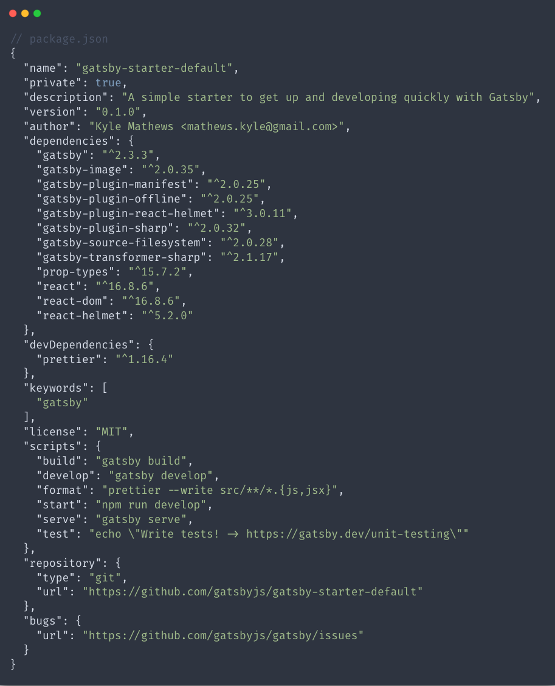
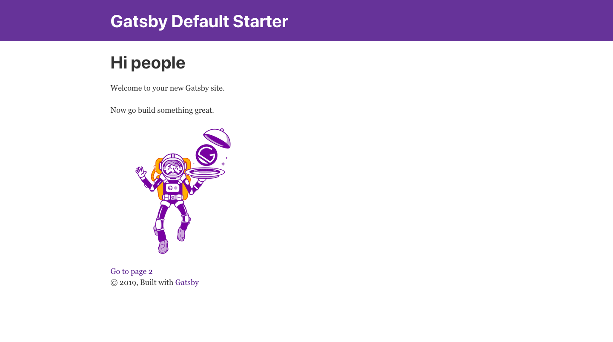
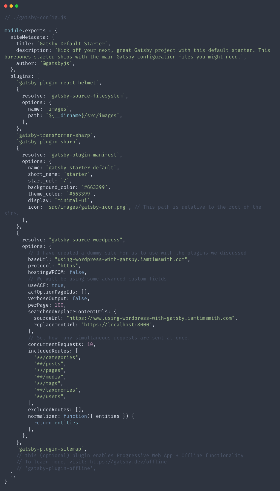
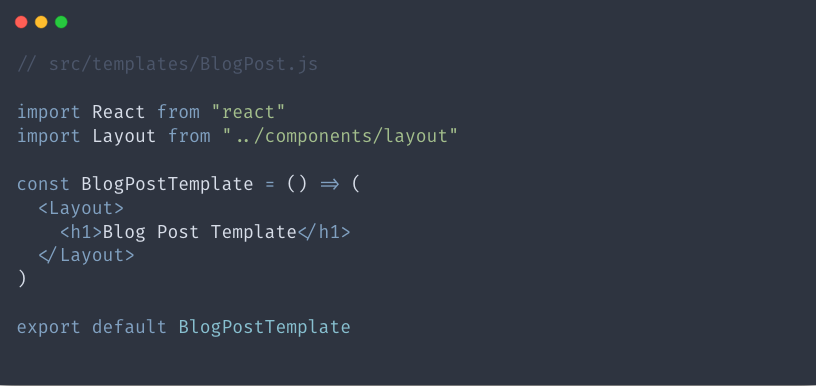
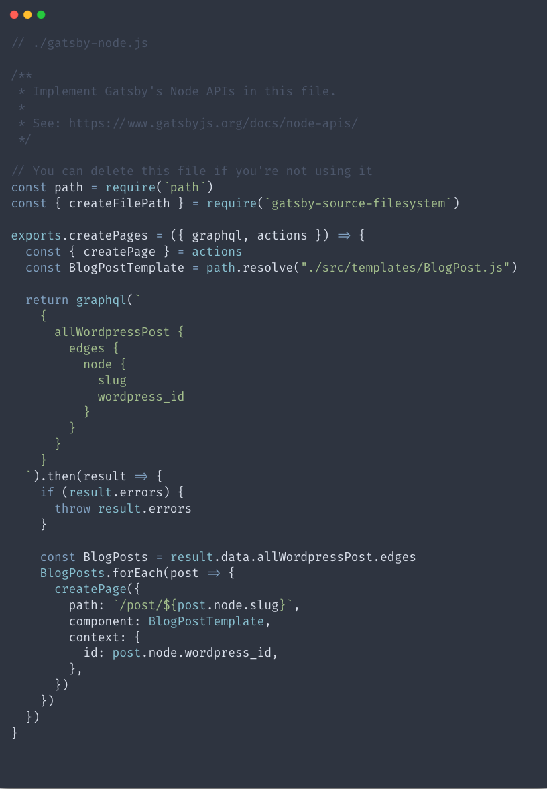
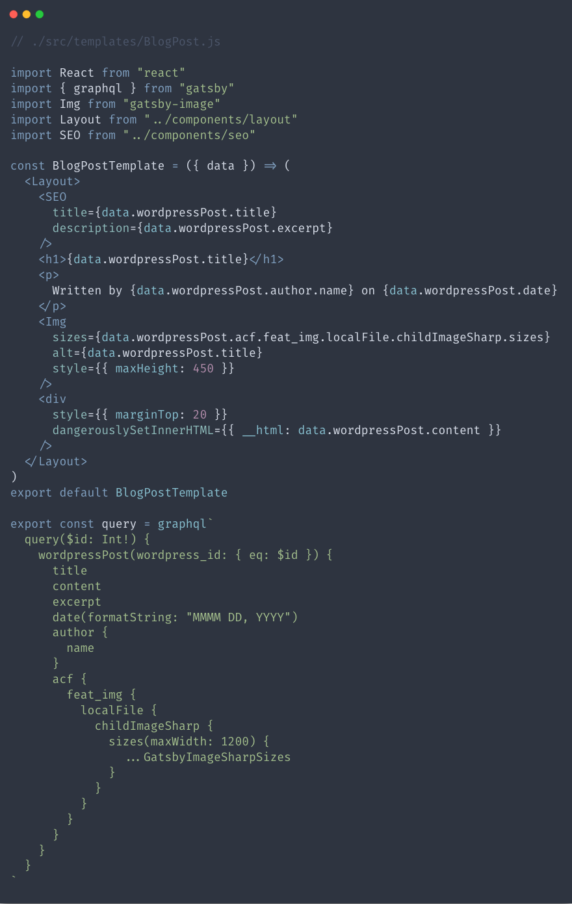
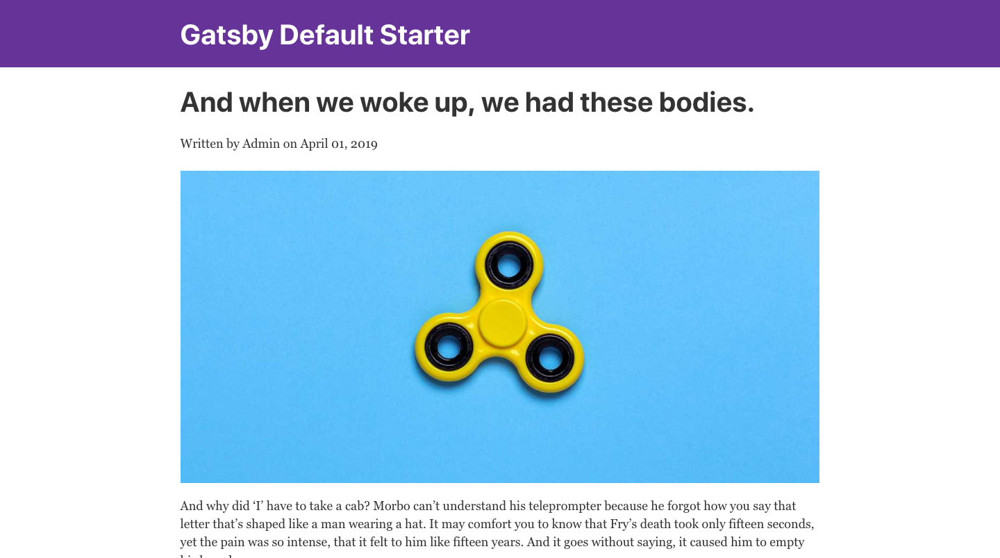

<article class="message">
  

    Note: This is part two in a series of posts about Gatsby.js and WordPress. You can find <a href="/blog/how-to-build-a-blog-with-wordpress-and-gatsby-part-1">Part One here</a>, and <a href="/blog/how-to-build-a-blog-with-wordpress-and-gatsby-part-3">Part Three here</a>.

    The code for this post can be found <a href="https://github.com/iamtimsmith/building-a-blog-with-wordpress-and-gatsby">here</a>.

  

</article>

In the last post, we covered setting up [WordPress for use with Gatsby](/blog/how-to-build-a-blog-with-wordpress-and-gatsby-part-1). Today we will cover how to pull the data from WordPress into Gatsby and build pages.

I have set up a wordpress site for us to use with the plugins mentioned in the last post as well as some dummy content for us to use. If you're curious, my favorite lorem generator is [Fillerama](http://fillerama.io/) which offers random content from Futurama, Monty Python, Star Wars, and more. This is where the content came from.

<video autoplay muted loop width="400">
  <source src="https://media.giphy.com/media/sDcfxFDozb3bO/giphy.mp4">
</video>

## Gatsby js Starter

One of the nice things about Gatsby are the starter projects. These are available for most applications and setups including WordPress, although we won't be using that today. We will just be using the starter default so we can configure everything ourselves.

In the future, it may be beneficial to take a look at the various starters and see if there's one that meets your needs. This can be a HUGE time saver and gives us the ability to get straight into the development portion without having to worry about configuration.

### Gatsby Default Starter

Before we get into the code, let's talk about the [Gatsby starter default](https://github.com/gatsbyjs/gatsby-starter-default). This project is the default (obviously) project that will be built when we create a new gatsby project with the cli. It comes with a few plugins, but not too much so it's wide open for customization.

Before we dig into the project files, lets set create our project. First we need to install the gatsby-cli tool with the code below:

Once that finishes installing, we can actually create our project. Navigate into the directory you want your project folder to live in and run the following command:

Now that we have our project created, let's take a look inside. We will see a `src` folder along with several files. Here's a little breakdown of what these do:

- **src/**: Directory that holds our React js project
- **.gitignore**: Tells what shouldn't be captured in git commits
- **.prettierrc**: Determines styles in code editor (tabs, quotes, etc)
- **LICENSE**: Basic MIT license
- **README.md**: Markdown file with instructions for use
- **gatsby-browser.js**: Gatsby Browser API stuff goes here. Global style calls go here too
- **gatsby-config.js**: Configuration for our project including meta data and plugins
- **gatsby-node.js**: Where we tell gatsby to build pages from a template using provided data
- **gatsby-ssr.js**: Gatsby Server Side Rendering APIs go here
- **package.json**: File which holds custom scripts, dependency information, etc

These files will be present in all Gatsby starters we use, so it's worth our time to have at least a basic level of understanding with each one. Let's take a look and see what dependencies and plugins we have by default. Open up the `package.json` file and scroll down to dependencies. This will tell us what packages we already have. Mine looks like this:

You can see there are several dependencies installed right off the bat. I'll just cover a few of them. Gatsby-Image creates an effect similar to Medium and also allows us to use responsive images and optimize our site. Gatsby-Transformer-Sharp is what creates the responsive and optimized images, then allows us to query for those through GraphQL. We also have Gatsby-Source-Filesystem which could be used to pull in markdown files for content, but we're using WordPress instead. The last package I want to mention is Gatsby-Plugin-React-Helmet, which allows us to create meta tags for the site's head which helps with SEO.

Whew! That was a mouthful.

<video autoplay muted loop width="400">
  <source src="https://media.giphy.com/media/eb3WAhXzlUAFi/giphy.mp4">
</video>

### Running the Site

We will be running our Gatsby js site in development so we can see what we're doing. Kinda hard to fly a plane when we can't see where we're going, right?

To do this, simply run the following command in the terminal and it will build the site in a development environment with hot reloading and more.

After running that command, we can visit [localhost:8000](http://localhost:8000) in the browser and we should see the site pictured below:

The site provides a navbar with a link going back to the homepage. There is also a bit of content with a link to page 2 which then provides a link back to page 1. It's very simple, but already we can see how fast gatsby js is.

## Adding Gatsby js Plugins

Now that we know what's already installed and what it looks like to start, we can add the stuff we need to use WordPress with our site. Fortunately for us, Gatsby has a page on their site where you can [see what plugins are available](https://www.gatsbyjs.org/plugins/). We will be adding the following plugins to our site: [Gatsby-Source-WordPress](https://www.gatsbyjs.org/packages/gatsby-source-wordpress/) and [Gatsby-Plugin-Sitemap](https://www.gatsbyjs.org/packages/gatsby-plugin-sitemap/).

To do this, we can use this code in the terminal:

Looking at our `package.json` file will reveal that each of these packages have been added to the project, but this isn't enough to start using the gatsby-plugin files. We first need to add them to the `gatsby-config.js` file. Luckily, the docs for these plugins are awesome and do a good job explaining all of this. I'd recommend you take a look at them to find out what each of the settings does, but I'll provide the code for the `gatsby-config.js` file after adding all of these plugins to our site:

### Making Sure Plugins Are Working

If the gatsby site is currently running, we need to stop it and restart it so it pulls in the new content from WordPress. It's important to know that while we can choose what information goes on what pages after our app is built, it will only pull content when it is initially run so changes in the source require a rebuild.

Once we've restarted our server, we can visit [http://localhost:8000/\_\_\_graphql](http://localhost:8000/___graphql) to use the "graphical" playground. Here, we can use graphql to query our data for testing purposes. We should create opening and closing curly braces and then we can use shift+space (ctrl+space on windows) to get suggestions. Once we have the data we want, we will be able to paste the query into our components, pages, and templates so we can use the information available. Here's what my query looks like for now:

You may notice that there are several drilldowns inside of the `acf` field. This is saying "hey, look for the acf field called feat_img and get the local, optimized versions of these images so we can use them". Gatsby also provides fragments which means inside of gatsby we could just put `...GatsbyImageSharpSizes` instead of drilling down so far and gatsby will know what to do with it.

Since we are seeing stuff on the right-hand side, it means that we are getting our data from WordPress, which is awesome! Now we need to tell gatsby what to do with the data, so let's talk about the `gatsby-node.js` file a bit.

## Creating pages in gatsby-node.js

As we briefly discussed earlier, the `gatsby-node.js` file is there so we can build pages programatically from data. There are two pieces to make this work: the logic in `gatsby-node.js` and a template file to render the data. Let's start by creating a simple template with no dynamic data just to make sure our logic is working properly.

### Creating Templates in Gatsby js

If we look inside the `src/` folder, we can see directories for components, images, and pages. We need to add one that will house our templates and then add a template for our blog posts. The following code will do this for us:

Unless there is some special functionality needed for blog posts, we can just [use a stateless functional component](/blog/class-components-vs-stateless-functional-components/). I won't go over components in this post, but if you need a refresher, you can [read up on components here](/blog/how-to-create-a-component/).

Below is the code I'm using for our template starter. This is just to make sure things are working after we finish setting up our `gatsby-node.js` logic. Once we know the page is being created, we will update the template to display correctly.

### What is Gatsby-Node.js Doing?

Now let's talk about `gatsby-node.js` a bit more. Let's start off by discussing why we should use it. We have the ability to create pages and query information for a single blog post, which is very useful... sometimes. Imagine our blog had 100 blog posts and we have to develop a gatsby site to display all of them. Do we really want to go in and create a separate page for every single one of them? That would be A LOT of copying and pasting, not to mention a huge waste of time.

Gatsby-node.js allows us to pull in a template file, then query our data using graphql. Then we can loop through the appropriate data and programmatically create a page for each piece of data, in our case blog posts and pages. This template will be universal so all blog posts or pages look the same. We can also use different templates for different content types so our pages and blog posts don't have to look the same.

<video autoplay muted loop>
  <source src="https://media.giphy.com/media/t3Mzdx0SA3Eis/giphy.mp4">
</video>

The code below pulls in the data for blog posts from wordpress and creates a page for each one using the createPage API provided by gatsby js. It is also much easier to pull in templates in this file using the path package, so I installed it using `yarn add path`.

Just like before, we will need to restart our development server to see these changes take place. Let's go ahead and do that so we can make sure our logic is working correctly. The easiest way I've found (in development) to see a list of pages is to go to a route that doesn't exist, such as [http://localhost:8000/stuff](http://localhost:8000/stuff).

We can now see all of the pages available and clicking on one should take us to the blog post template we created earlier that just shows Hello World. If this is what you're seeing, congrats! You're ready to move to the next section.

## Updating Our Blog Post Template

Now that we have pages being created at the desired locations, we should update our blog post template to display the appropriate data. Although we need to make some changes, we will keep it as a stateless functional component. The code below will create our template. I would like to point out that we are using graphql to query the information which is then used as a prop called data.

You may notice that there are a few components inside of our template that we didn't create. These come along with the gatsby starter default and can be modified as needed.

The Layout component allows us to set a standard layout including header, footer, sidebar, etc on every page. Then we can just wrap our page inside that global layout without having to worry about importing everything inside of every template or page.

The SEO component allows us to pass in dynamic data such as title, description, and keywords and the component will add those things to the head to improve our site's SEO score. I typically modify this component a bit so I can also pass in an image and I add a few properties to the meta, which allows twitter, facebook, and other sites to display a card like we expect with an image and everything.

Here's what our completed Blog Post looks like after we update the template:

## Wrapping up Blog Posts

We're about half-way done with the actual Gatsby js build. In this post we covered how to import blog posts from WordPress into our Gatsby js application and create pages automatically for each post. Honestly, this is the hardest part about making sites in Gatsby. If you're still keeping up, great job! If you're struggling, don't be too hard on yourself. This stuff is hard. If you need to, you can reach out to me on twitter [@iam_timsmith](https://www.twitter.com/iam_timsmith) and I'll be happy to help you.

<video autoplay muted loop width="300">
  <source src="https://media.giphy.com/media/14cDsqOkks6O8U/giphy.mp4">
</video>

The code for this tutorial can be found [here](https://github.com/iamtimsmith/building-a-blog-with-wordpress-and-gatsby)

See you in [How To Build A Blog with Wordpress and Gatsby.js - Part 3](/blog/how-to-build-a-blog-with-wordpress-and-gatsby-part-3)!
