<article class="message">
  

    Note: This is part three in a series of posts about Gatsby.js and WordPress. You can find <a href="/blog/how-to-build-a-blog-with-wordpress-and-gatsby-part-1">Part One here</a>, and <a href="/blog/how-to-build-a-blog-with-wordpress-and-gatsby-part-2">Part Two here</a>.

    The code for this post can be found <a href="https://github.com/iamtimsmith/building-a-blog-with-wordpress-and-gatsby">here</a>.

  

</article>

In the third part of this series about WordPress and Gatsby js, we will be creating pages using templates and components using data from WordPress.

So far, we've talked about what themes and plugins to use for a WordPress back-end and why. We have also created a new Gatsby js site and set it up to create routes for our blog posts programmatically. We will be using the same skills for some of the things in this post since we probably want to have a default template for our static pages. We will then create React js components in the `/pages` directory which will replace the default template for the desired pages, in this case our home page.

## Creating a Page Template

As you'll recall from the last post, we should create a page template before adding the `createPages` api to the gatsby-node.js file so it has something to call. To do this, we'll create a file in the pages directory called PageTemplate.js using the code below:

Just like with the blog post template, we can probably just use a [stateless functional component](/blog/class-components-vs-stateless-functional-components/) for this. Like before, we won't cover how to create a component in this article, but you can read about [creating a react js component here](/blog/how-to-create-a-component/).

We will go ahead and start off with a generic template again and then we will fill it out later with the appropriate data. The code below will get a simple template created for us to use for pages for now:

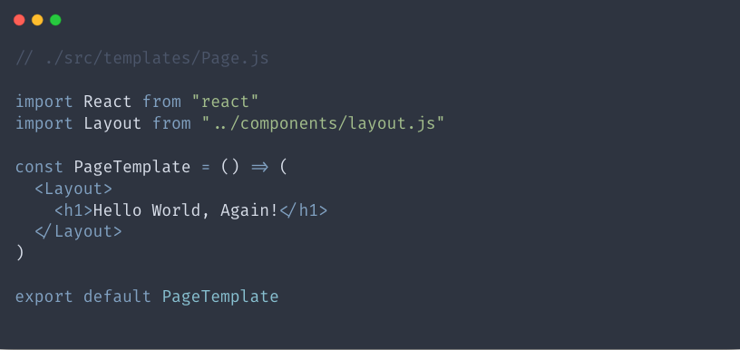

## Adding pages to gatsby-node.js

Awesome! Now that we have our page template created, we can add pages to the gatsby-node.js file pretty easily. First, we will import the template just like we did for the BlogPostTemplate. Then we will add the allWordpressPage piece to the graphql query. Finally, we will use the `createPage` api to create pages based on the information retrieved from the graphql query and use the Page template to build the pages automatically. Below is our finished gatsby-node.js file. See if you can spot the things I mentioned for the pages.

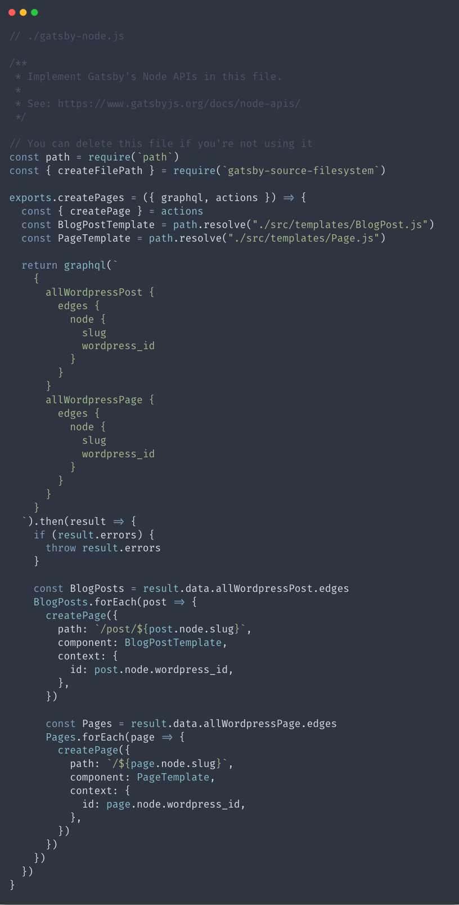

Just like before, we can test this to make sure the pages were created as expected by starting our development server and visiting [localhost:8000/stuff](http://localhost:8000/stuff) and getting a list of all of the available pages. Again, this is only available in a development environment since a live site will show a different 404 page. We should see an `/about` page and a `/sample-page` page in there. If so, our gatsby-node.js file worked and we can update the template to show the data we want.

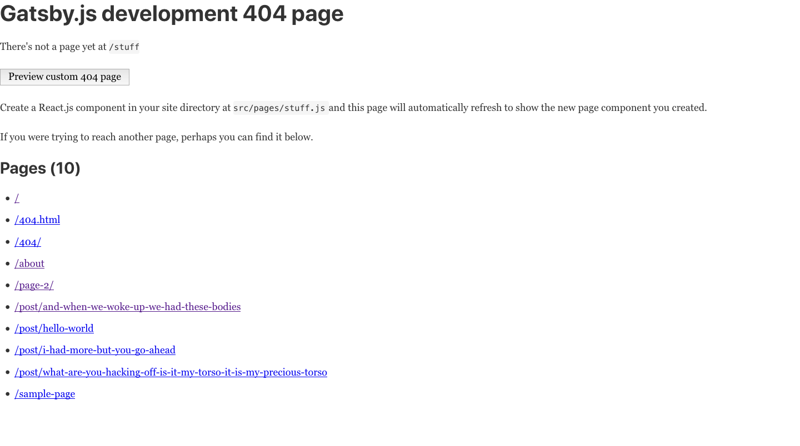

## Updating the Page Template

Since we have our page routes set up, we can start adding to the template. This will look very similar to the BlogPost.js file with only a few differences. In our blog, we aren't going to have a featured image for static pages, so we can go ahead and leave that piece out of the query. We also don't need a date or author for the pages since they don't change. Essentially all we'll need is a title and content along with an excerpt for the SEO component.

The end result is a pretty simple component as shown below:

I mentioned at the end of [part two](/blog/how-to-build-a-blog-with-wordpress-and-gatsby-part-2) that configuring the gatsby-node.js file is probably the most difficult part of this whole thing. Since we worked our way through that already and understand how it works, setting up another content type was cake, right?

<video autoplay muted loop width="400">
  <source src="https://media.giphy.com/media/zcCGBRQshGdt6/giphy.mp4">
</video>

Now if we visit the about page at [http://localhost:8000/about](http://localhost:8000/about), we can see the data coming in from WordPress. If we inspect the page and look at the head, we can also see that the title and meta tags are being updated in the head because of the SEO component!

## Creating Pages in the Pages Directory

Gatsby js provides some awesome out-of-the-box routing. Anything we create in the `/pages` directory will automatically create a route for us. For instance, if we were to create a file called `gatsby-is-awesome.js`, Gatsby js would see that and create a route called http://localhost:8000/gatsby-is-awesome.

We can also see that the starter default comes with a few pages already in the `/pages` directory. The index page is what will show when a user visits [http://localhost:8000/](http://localhost:8000/). There is also a file called page-2.js which is just a simple page to show how linking works. Finally, there is a 404.js available which is the 404 page that shows when our gatsby js site is live.

Since we want our blog to show up on the homepage, we can edit the file called `index.js` to do this. Let's take a look at this file before we make any changes:

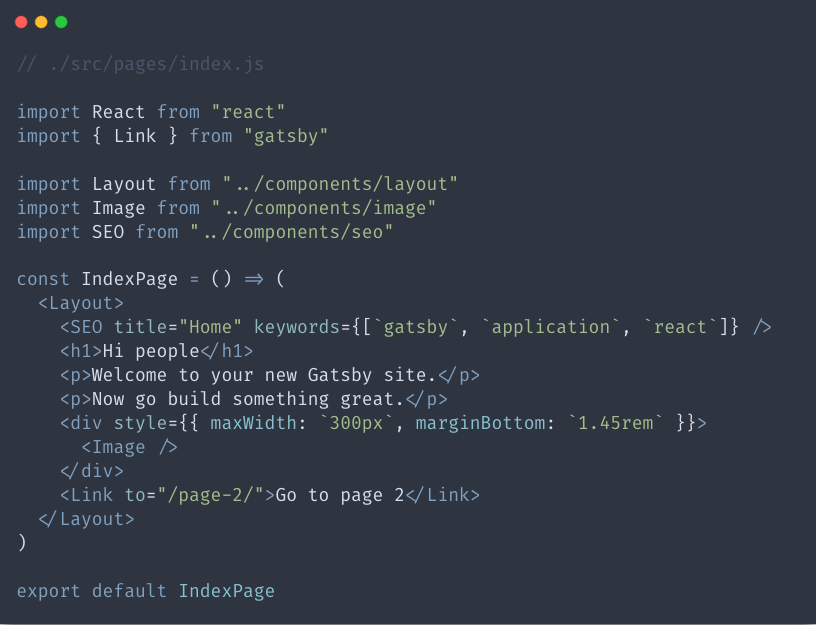

We are going to remove everything after the SEO tag but before the closing Layout tag and replace it with our own stuff. We can also use a query pretty similar to the one in the blog post template except for the content piece. We can just use the excerpt provided by the WordPress API.

To keep things simple, we'll just create a list of recent blog posts with an image, title, author, date, and excerpt. Each of the items in this list should link to the individual blog post for readers. Below is the code to create this layout. It's pretty straightforward and looks very similar to our blog post template with the exception of the map function which iterates over the items in an array.

And here's what it looks like when we visit the homepage of our blog:

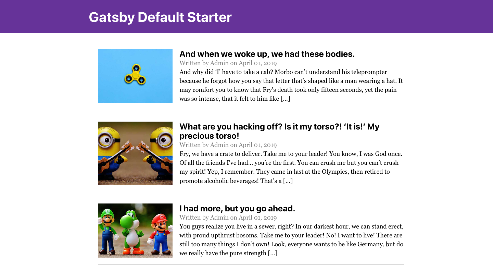

It's looking pretty good so far. We're getting pretty close to being done, we just have a few more things to change and we're ready to start blogging!

<video autoplay muted loop>
  <source src="https://media.giphy.com/media/qLWdMYX1NYF2g/giphy.mp4">
</video>

## Changing the Header Component

One of the first things I notice about the blog pictured above is the header. It doesn't look bad, but we probably don't want our blog to say "Gatsby Default Starter". There are a few ways we can change this, which we'll go over real quick.

### In the Gatsby-Config.js File

In the gatsby-config.js file, we can see a piece at the top called `siteMetaData` with a title, description, and author. This is where some basic information is kept about the project for the SEO component, but also for the site name.

The title we're seeing in the header comes from the title listed here. We can change it to whatever we'd like our site to be called. Usually when building a WordPress site, I get all of my data for this from WordPress but in the case of a site using markdown or something different we may want to use the stuff located here.

### In the Header Component

Since we are building a blog using WordPress and want our users to have full control over the data, we should get our site name from WordPress so if it ever changes the user can update it. Fortunately, WordPress makes this available to us through the API, so we can query it in graphql like so:

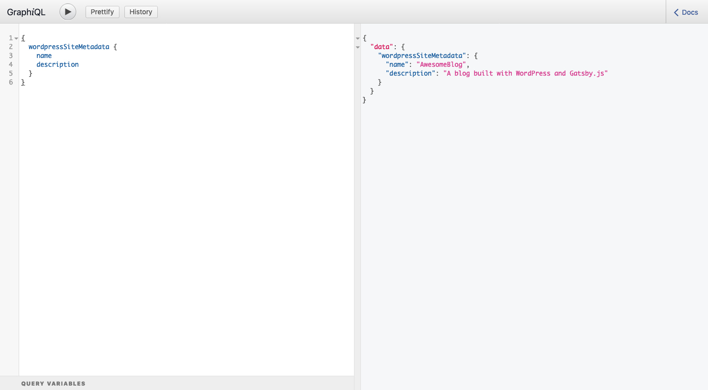

Using queries works a bit differently inside of components. Rather than just writing a query which drops data into our page or template, we have to use a new component called `StaticQuery` which is designed specifically for using queries inside of components.

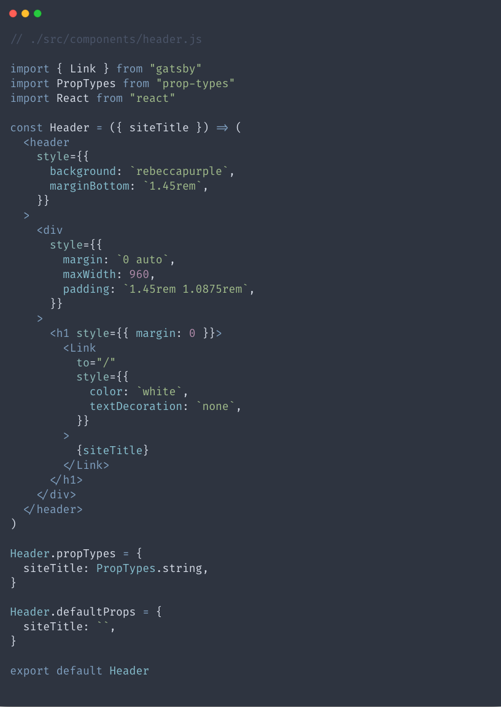

If we take a quick look at the existing header component, we will see that a site-title is being passed in as a prop which is then used to display the site title from `gatsby-config.js` in the header. What we are going to do is use the `StaticQuery` component provided by gatsby and use a query prop to run our query and then a render prop to actually render out our component like we normally would. You can see below how we do this in code:

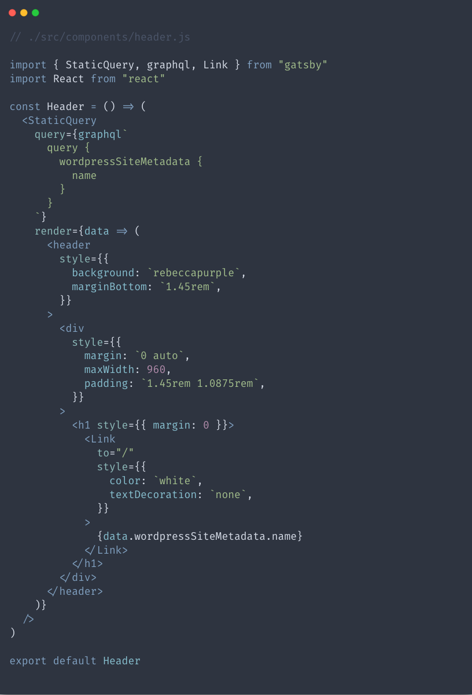

The header component above looks a little different than it originally did, but as we start to dig into it a bit more we can see it hasn't changed much. We essentially just wrapped our header in the StaticQuery component and then ran our query inside of that component to give the header the necessary data. Simple, right?

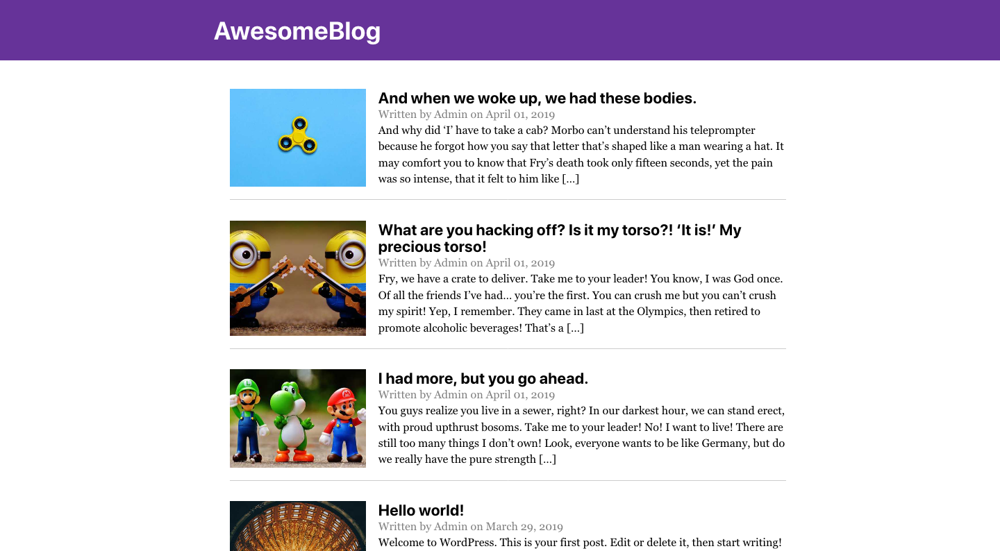

### Adding a Menu to the Header

Let's take it a step further and say our user wants a menu in the header that he or she can update from WordPress. If you'll recall in the [first part of this series](/blog/how-to-build-a-blog-with-wordpress-and-gatsby-part-1), I mentioned a plugin called WP API Menus which will make our menus available in the Rest API.

When we were setting our gatsby-config.js file in the [second part of the series](/blog/how-to-build-a-blog-with-wordpress-and-gatsby-part-2), we just stuck with the default routes provided in the gatsby-source-wordpress docs. The WP API Menus plugin creates a few new routes for those endpoints, so the first thing we need to do is add these endpoints to the gatsby-config.js file.

If you look at the code above, you'll notice we have added two new routes to the gatsby-source-wordpress. These routes are created automatically by the plugin inside of WordPress without any additional configuration. Remember, after making changes to files outside of the src folder, we need to restart our development server by running `gatsby develop`. After restarting, we can visit [http://localhost:8000/\_\_\_graphql](http://localhost:8000/___graphql) and query for the menu information, which will like like the screenshot below.

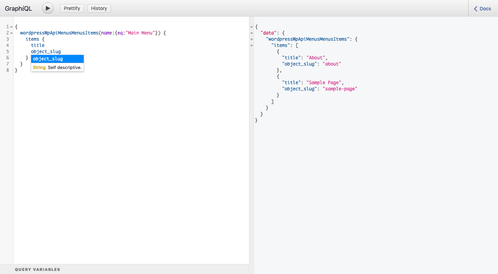

The final step is to add this query into our static query and create the menu itself in the header component. We can just drop this in under the wordpressSiteMetadata piece. Once we have it added into the query, we can just use a `map()` function to iterate over the menu items and create it dynamically, allowing the user to update it through WordPress. Doing it this way does require us to specify which menu we want, so we need the name of the menu which is set in WordPress. In this case, our menu is called Main Menu so we will use that in our query.

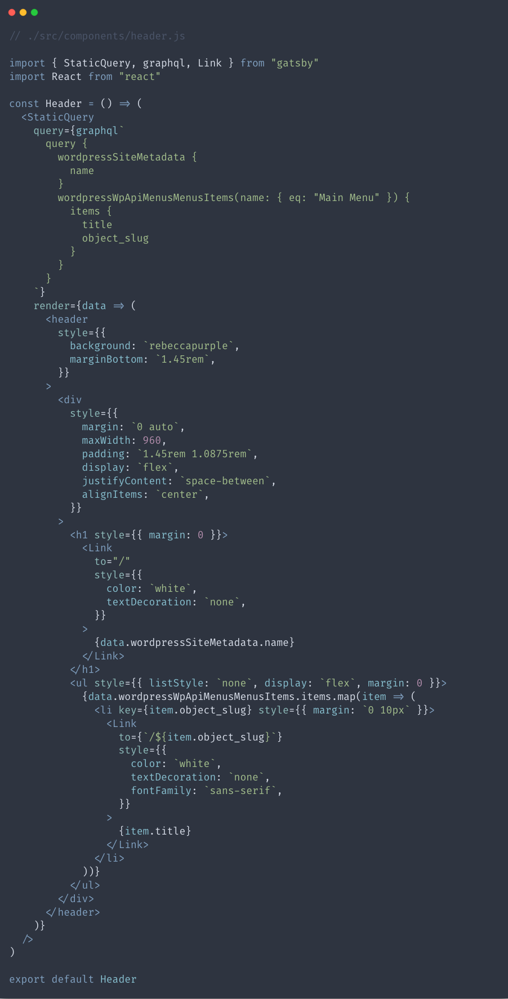

That's a good looking component! Let's see what it looks like when we visit the site:

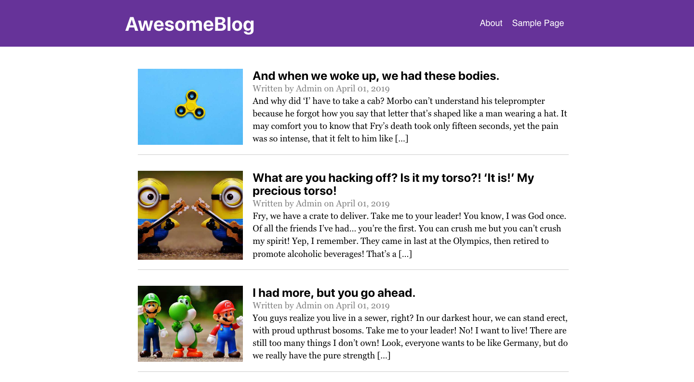

## Wrapping up

Well done! We now have a functioning blog using WordPress and Gatsby js. There are more things we can do to add custom functionality such as custom post types, galleries, and more, but this is enough to get us started for now. As we've seen, it's pretty simple to get up and running with this stack. It's the best of both worlds since clients and users get the awesome experience of content creating with WordPress and as developers we can leverage the awesome capabilities of Gatsby js. As usual, go forth and make the internet a better place to be!

If you have any thoughts or questions, you can find me on twitter at [@iam_timsmith](https://twitter.com/iam_timsmith)!
